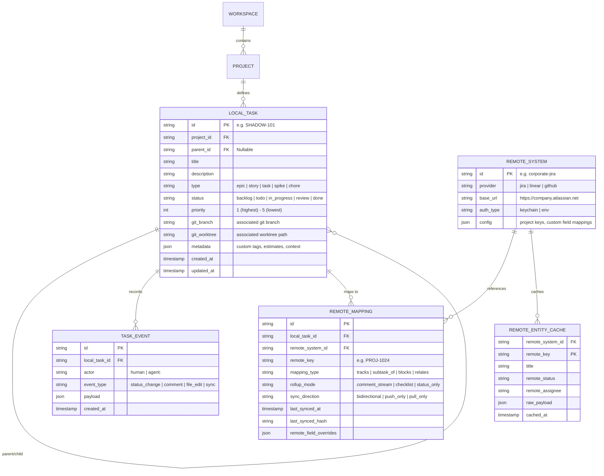

# Product Requirements Document (PRD)

# Project Shadow: Local-First Developer Project Management & Enterprise Sync Bridge

**Document Version:** 1.1.0  
**Status:** Draft / Proposed  
**Author:** Jacob Miller & Antigravity  
**Target Audience:** Engineering, Product, AI Agent Tooling  

---

## 1. Executive Summary & Vision

### 1.1 Vision Statement
> *"Your machine, your workflow, your agents. Company sync on your terms."*

**Shadow** is a local-first, developer-centric project management tool and synchronization bridge. It is built specifically for modern software engineers and their autonomous/semi-autonomous AI coding agents (such as Antigravity, Claude Code, Cursor, Copilot CLI, and custom agents). 

Shadow decouples **how a developer works and thinks** from **how an enterprise tracks and reports**. It provides a lightning-fast, offline-capable, local project management engine with configurable hierarchies (Epics, Stories, Tasks, Spikes, Subtasks) that developers and AI agents can query and manipulate in real-time. 

**Zero-Daemon Architecture:** Shadow deliberately avoids background protocol servers or complex middleware like MCP (Model Context Protocol). Instead, Shadow relies entirely on a **rich, deterministic CLI** paired with an **Agent Skill specification (`SKILL.md`)**. Both the human engineer and the AI agent use the exact same high-performance command line interface, enabling instant portability across any AI environment (Antigravity, Claude Code, Cursor, terminal agents) with zero process overhead or socket lifecycle management.

Through an intelligent **$N \leftrightarrow M$ mapping engine**, Shadow aggregates, decomposes, sanitizes, and synchronizes work on an ad-hoc basis with mandated corporate tools such as **Jira**, **Linear**, **GitHub Issues**, and **Azure DevOps**.

```
+-----------------------------------------------------------------------------------+
|                              LOCAL DEVELOPER WORKSPACE                            |
|                                                                                   |
|   +-------------------+      +------------------------------------------+         |
|   | Human Developer   |      |  AI Coding Agents                        |         |
|   | (Terminal / IDE)  |      |  (Antigravity, Claude Code, Cursor)      |         |
|   +---------+---------+      +--------------------+---------------------+         |
|             |                                     |                               |
|             |                     Loads & Follows | `SKILL.md` Protocol           |
|             |                                     v                               |
|             |                +------------------------------------------+         |
|             |                | Agent Skill Layer (Behavior & Prompts)   |         |
|             |                +--------------------+---------------------+         |
|             |                                     |                               |
|             +------------+------------------------+                               |
|                          | Executes via Shell / Terminal                          |
|                          v                                                        |
|             +------------------------------------------------+                    |
|             |                   SHADOW CLI                   |                    |
|             |  - Human Mode (Interactive, Tables, TUI)       |                    |
|             |  - Agent Mode (--json, --quiet, Deterministic) |                    |
|             +-----------------------+------------------------+                    |
|                                     |                                             |
|                                     v                                             |
|             +------------------------------------------------+                    |
|             |                 SHADOW ENGINE                  |                    |
|             |  - Local Task Hierarchy (Epics/Stories/Tasks)  |                    |
|             |  - Fast Storage (Embedded SQLite / Git-backed) |                    |
|             |  - N <-> M Relational Mapping & Rollups        |                    |
|             |  - Privacy & Sanitization Firewall             |                    |
|             +-----------------------+------------------------+                    |
+-------------------------------------|---------------------------------------------+
                                      |
                                      |  Ad-hoc / Selective / N <-> M Bi-directional Sync
                                      v
+-----------------------------------------------------------------------------------+
|                        ORGANIZATIONAL PM TOOLING (REMOTE)                         |
|                                                                                   |
|           +--------------+   +--------------+   +---------------+                 |
|           |  Atlassian   |   |    Linear    |   | GitHub Issues |                 |
|           |     Jira     |   |              |   | Azure DevOps  |                 |
|           +--------------+   +--------------+   +---------------+                 |
+-----------------------------------------------------------------------------------+
```

### 1.2 Core Value Propositions
1. **Zero Flow Interruption:** Sub-millisecond local reads and writes. No corporate SSO gates, 10-second web page loads, or mandatory multi-select dropdown forms blocking developer momentum.
2. **First-Class Agent Ergonomics (CLI + Skills):** No background MCP daemon to start, configure, crash, or maintain. Coding agents load the official `SKILL.md` protocol and execute fast, deterministic `shadow` CLI commands with structured `--json` outputs.
3. **Arbitrary $N \leftrightarrow M$ Projection:** Break a massive corporate Jira epic into 15 focused local tasks, or roll up 8 micro-tasks and exploratory spikes into a single clean Jira story update.
4. **Data Privacy & Noise Firewall:** Developer scratchpads, agent debug traces, failing test iterations, and intermediate thought logs remain local. Only curated, sanitized rollups reach organizational systems.
5. **Offline-First Resilience:** Fully functional on planes, trains, or during enterprise VPN/Jira outages, with deferred reconciliation.

---

## 2. Problem Statement & Market Opportunity

### 2.1 The Enterprise Tooling Trap
Virtually all software engineering organizations enforce centralized project management systems (primarily Jira, Rally, ServiceNow, and Azure DevOps). These platforms are designed for:
- Executive portfolio management and resource allocation.
- Cross-functional stakeholder visibility (Product, Sales, Support, Compliance).
- Release train management and enterprise audit trails.

While essential for the enterprise, these tools are **actively hostile to individual developer workflows**:
- **Impedance Mismatch:** Enterprise tracking operates at a sprint/quarterly granularity; developer thought processes operate at the minute/hour/commit level.
- **Administrative Friction:** Ticket creation requires filling out mandatory fields (Story Points, Fix Versions, Components, Risk Ratings, Epic Links, Team Assignments) that add cognitive load to simple tasks.
- **Slow, Bloated Web Interfaces:** Heavy single-page apps loaded with enterprise plugins take seconds to load and navigate, breaking flow state.

### 2.2 The Fidelity Mismatch (The Two Extremes)

```
       ORGANIZATION DEMANDS                                     DEVELOPER WANTS
------------------------------------------------------------------------------------
Scenario A: High Org Fidelity / Low Dev Need
[15 Required Fields, Points, Compliance]  <---- MISMATCH ---->  [Quick 3-line bugfix]
(Heavy enterprise tax on trivial work)

Scenario B: Low Org Fidelity / High Dev Need
[Single high-level Jira Story]           <---- MISMATCH ---->  [25 local micro-tasks,
(Org doesn't want sprint board spam)                             investigative spikes,
                                                                 subagent branches]
```

1. **Scenario A: High Org Fidelity, Low Developer Need**  
   The company requires exhaustive metadata for every minor chore. A developer fixing a trivial typo or updating a dependency must spend 10 minutes filling out fields in Jira just to satisfy corporate compliance metrics.
2. **Scenario B: Low Org Fidelity, High Developer Need**  
   A developer executing a major architectural refactor wants to break it down into 20 granular steps: profiling, spike implementation, database migration testing, subagent code reviews, and verification scripts. If the developer logs all 20 tickets in Jira:
   - It pollutes the team’s sprint board.
   - It triggers dozens of automated notifications in team Slack channels.
   - Product managers complain about ticket fragmentation and unpointed cards.  
   If the developer *doesn't* log them, the work becomes invisible, context is lost during interrupts, and progress is untracked.

### 2.3 The AI Agent Interface Dilemma: Why CLI & Skills Win Over MCP
Autonomous coding agents (Antigravity, Cursor, Claude Code, Cline, Aider) execute tasks in iterative loops: decomposing prompts, editing files, running tests, self-debugging, and asking for clarifications.
- **The Pitfalls of MCP for Local Tools:**
  - Running a separate MCP server daemon requires ongoing process management, socket listeners, port binding, and JSON-RPC message serialization.
  - Configuration differs wildly across IDEs and tools (`claude_desktop_config.json`, `.cursor/mcp.json`, custom flags), making setup brittle and error-prone.
  - Background server crashes or hung socket connections leave agents stranded or silently failing.
- **The Superiority of CLI + Skills:**
  - **Universal Support:** Every AI coding agent can execute shell commands (`run_command`, `bash`, `exec`).
  - **Single Shared Tooling:** The developer and the AI use the exact same CLI binary (`shadow`). There are no "hidden tools" or disparities between what the human sees and what the agent sees.
  - **Behavior Encapsulated in Skills:** Standardized `SKILL.md` markdown files teach agents the exact operational protocols: when to log tasks, how to decompose epics, how to format commit tags, and how to verify before closing.

---

## 3. Goals and Non-Goals

### 3.1 Product Goals
- **Local Autonomy:** Provide a 100% locally hosted project management core accessible exclusively via an ultra-fast, robust CLI (`shadow`).
- **Agent-Native via Skills:** Deliver a comprehensive, official `SKILL.md` specification that equips any AI coding agent with the intelligence, triggers, and protocols to manage tasks autonomously.
- **$N \leftrightarrow M$ Relationship Mapping:** Enable any number of local tasks/epics/spikes to link to any number of remote tickets with custom rollups and projections.
- **Selective & Ad-Hoc Sync:** Give the developer complete authority over *when* and *what* syncs to organizational tooling (e.g., manual command `shadow sync`, git commit hook, PR creation, or scheduled batch).
- **Sanitization & Redaction:** Provide automated filtering and markdown-to-rich-text transformers that scrub local debug noise, agent traces, and sensitive internal paths before syncing upstream.
- **Pluggable Architecture:** Support multiple remote providers via a unified connector interface (starting with Atlassian Jira, Linear, and GitHub Issues).

### 3.2 Non-Goals
- **No MCP Server:** Shadow explicitly does NOT implement or require a Model Context Protocol server. All programmatic access is handled via the CLI with `--json` and standard I/O.
- **Replacing Jira for the Enterprise:** Shadow is not an enterprise-wide Jira replacement. It is a personal developer-tier proxy and local command center that coexists with Jira.
- **Real-Time Multiplayer Collaboration (v1):** Phase 1 focuses on the individual developer and their machine's agents. Team-wide peer-to-peer sync is deferred to future phases.
- **Complex Gantt/Waterfall Scheduling:** Shadow focuses on agile execution, task breakdowns, state transitions, and issue synchronization—not enterprise resource capacity planning.

---

## 4. User Personas & Target Audiences

| Persona | Description | Core Frustrations with Current Tools | How Shadow Wins |
|---|---|---|---|
| **The Flow-Driven Engineer** | Senior/Staff engineer who lives in the terminal, Neovim/VSCode, and git. | Jira web UI is slow and interrupts flow. Mandatory corporate fields feel like bureaucratic waste. | Instant CLI commands (`shadow add`, `shadow done`), zero-lag local tasks, push to Jira on git push or PR creation. |
| **The Agentic Developer** | Uses AI agents (Antigravity, Claude Code, Cursor) for 60%+ of code generation. | Agents have no structured PM tool to track subtasks without spamming Jira with 30 micro-cards. MCP daemons are brittle. | Agent loads `SKILL.md` and uses `shadow --json` to track and close micro-tasks locally; rolls up summary to Jira. |
| **The Cross-Functional Lead** | Works across multiple repositories and multiple organizational teams. | A single technical project requires tickets in 3 different Jira projects owned by 3 different teams. | $1 \leftrightarrow M$ mapping: lead manages one local Epic in Shadow, mapped across 3 disparate Jira tickets. |
| **The Compliance-Taxed Dev** | Works in highly regulated industries (finance, healthcare, defense). | Must satisfy heavy audit and compliance tracking while writing fast code. | Shadow handles automated rollup and template generation to satisfy corporate audit fields without manual hassle. |

---

## 5. Architectural Overview & System Components

### 5.1 Architecture Diagram

```
+----------------------------------------------------------------------------------------+
|                                    SHADOW ARCHITECTURE                                 |
+----------------------------------------------------------------------------------------+

  HUMAN DEVELOPER                                      AI CODING AGENTS
  (Terminal / Tmux / IDE)                              (Antigravity, Claude Code, Cursor)
        |                                                     |
        |                                                     | Loads instructions
        |                                                     v
        |                                       +-----------------------------+
        |                                       |     Shadow Skill Layer      |
        |                                       |        (SKILL.md)           |
        |                                       +--------------+--------------+
        |                                                      |
        |  Interactive Terminal Commands                       | Non-interactive Shell Calls
        |  (e.g., `shadow task add`)                           | (e.g., `shadow task add --json`)
        +------------------------------+-----------------------+
                                       |
                                       v
+----------------------------------------------------------------------------------------+
|                                     SHADOW CLI                                         |
|                                                                                        |
|   +---------------------------------------+  +-------------------------------------+   |
|   | Human UX Layer                        |  | Machine / Agent UX Layer            |   |
|   | - Rich Terminal Tables & Colors       |  | - Strict JSON Schema Outputs        |   |
|   | - Interactive Prompts & Fuzzy Finder  |  | - Silent / Machine Exit Codes       |   |
|   | - Terminal UI (TUI) Dashboard         |  | - Stdin Pipe Ingestion / Streaming  |   |
|   +-------------------+-------------------+  +-------------------+-----------------+   |
|                       |                                          |                     |
|                       +--------------------+---------------------+                     |
|                                            |                                           |
|                                            v                                           |
|   +--------------------------------------------------------------------------------+   |
|   | Core Dispatcher & Validation Engine                                            |   |
|   +--------------------------------------------------------------------------------+   |
+--------------------------------------------+-------------------------------------------+
                                             |
                                             v
+----------------------------------------------------------------------------------------+
|                                SHADOW CORE ENGINE                                      |
|                                                                                        |
|   +---------------------------+  +------------------------+  +---------------------+   |
|   | Task & Hierarchy Engine   |  | Mapping & Rollup Engine|  | Sync & State Engine |   |
|   | - Epics / Stories / Tasks |  | - N:M Relational Graph |  | - Push / Pull / Diff|   |
|   | - Custom States & Tags    |  | - Markdown Projections |  | - Conflict Resolver |   |
|   | - Git Branch/Commit Links |  | - Rollup Summarizers   |  | - Offline Mutation  |   |
|   | - Worktree Integration    |  | - Field Translators    |  |   Queue             |   |
|   +-------------+-------------+  +-----------+------------+  +----------+----------+   |
|                 |                            |                          |              |
|                 +----------------------------+--------------------------+              |
|                                              |                                         |
|                                              v                                         |
|   +--------------------------------------------------------------------------------+   |
|   | Privacy & Sanitization Firewall (Redaction, field masking, noise stripping)    |   |
|   +--------------------------------------------------------------------------------+   |
+----------------------------------------------+-----------------------------------------+
                                               |
                          +--------------------+--------------------+
                          |                                         |
                          v                                         v
   LOCAL STORAGE SUBSYSTEM                             REMOTE CONNECTOR SUBSYSTEM
   +------------------------------------+              +------------------------------------+
   | - Embedded SQLite (WAL Mode)       |              | Pluggable Remote Connectors:       |
   | - Flat-file YAML/Markdown Mirror   |              | - Atlassian Jira (REST v3 / ADF)   |
   | - OS Keychain Credential Store     |              | - Linear Connector (GraphQL)       |
   | - Offline Mutation Queue           |              | - GitHub Issues Connector (REST)   |
   +------------------------------------+              | - Azure DevOps Connector (REST)    |
                                                       +------------------------------------+
```

### 5.2 Key Subsystems

#### 1. The Shadow CLI & Machine Interface
The CLI is the single entry point for all operations. It provides two operational modes:
- **Interactive Human Mode:** Color-coded terminal tables, fuzzy searching, interactive prompts, and an optional TUI dashboard.
- **Machine/Agent Mode (`--json`):** Emits strictly validated JSON schemas to `stdout`, operational logs to `stderr`, and uses explicit exit codes (`0` for success, non-zero for specific error types). Supports non-interactive confirmation flags (`--yes`, `--force`) and reading markdown payloads from files or `stdin`.

#### 2. The Agent Skill Layer (`SKILL.md`)
Rather than relying on RPC servers, agent intelligence is governed by standardized skill documentation:
- Ingested directly by AI agents (Claude Code, Antigravity, Cursor).
- Teaches the agent:
  1. **Lifecycle Triggers:** When to query Shadow (session start, task pivots, git branch transitions, wrap-up).
  2. **Decomposition Protocols:** How to take a high-level task and break it into atomic CLI additions (`shadow task add --parent ...`).
  3. **Verification Standards:** Dual-verification criteria before marking tasks complete (unit tests + runtime verification).
  4. **Anti-Bloat Discipline:** How to post append-only progress logs and avoid polluting remote trackers.

#### 3. Task & Hierarchy Engine
- Maintains the local entity graph: **Initiative $\rightarrow$ Epic $\rightarrow$ Story $\rightarrow$ Task $\rightarrow$ Subtask / Checklist**.
- Flexible metadata schema: supports custom user-defined statuses, priorities, context tags, deadlines, branch names, and worktree associations (`wt`).
- Git Context Attachment: automatically binds current git commit hashes, branch names, and worktree paths to tasks.

#### 4. The $N \leftrightarrow M$ Mapping & Relationship Matrix
- Maintains bidirectional links between local IDs (e.g. `SHADOW-42`, `local-task-88`) and remote keys (e.g. `JIRA-PROJ-1042`, `LINEAR-ENG-512`).
- Supports arbitrary topological relationships:
  - **$N:1$ Rollup:** Multiple local tasks project into a single remote issue.
  - **$1:M$ Fan-out:** One local epic coordinates work distributed across multiple remote issues.
  - **$1:1$ Mirror:** Standard direct mapping.
  - **$N:0$ Private:** Local-only tasks, spikes, and agent checklists that are intentionally never synced.
  - **$N:M$ Matrix:** Complex multi-component groupings.

#### 5. Projection & Rollup Engine
- Generates rendered artifacts for remote synchronization based on local task state.
- **Rollup Summarizer:** When syncing $N$ local tasks to 1 Jira issue, creates a clean, formatted Markdown/ADF status comment or updates the Jira issue body checklist:
  ```markdown
  ### 🤖 Engineering Progress Update (via Shadow)
  **Completed Tasks (3/4):**
  - [x] Refactor JWT validation middleware (Commit: `8a7b1c`)
  - [x] Migrate unit test harness to mock provider
  - [x] Benchmark auth latency under 1,000 req/sec load
  **In Progress:**
  - [ ] Update staging environment secret rotation policy
  ```
- **Field Translators:** Maps local statuses (e.g., `in_development`, `agent_evaluating`) to remote workflow transitions (e.g., `In Progress`, `Under Code Review`).

#### 6. Privacy & Sanitization Firewall
- Acts as a zero-trust perimeter between the developer's machine and corporate servers.
- **Rule Engine:**
  - Strips designated fields (e.g. `notes`, `scratchpad`, `agent_debug_log`, `internal_cost`).
  - Redacts sensitive patterns (tokens, IP addresses, proprietary URLs, local filesystem paths like `/Users/username/...`).
  - Enforces developer sign-off if configured (`shadow sync --dry-run` or interactive approval).

#### 7. Offline Queue & Sync State Engine
- Maintains a local SQLite write-ahead log (WAL) of pending synchronization mutations.
- Network-agnostic: if Jira is unreachable, mutations are queued chronologically.
- Resolves conflicts using configurable strategies:
  - `local-wins`: Local developer state overrides remote.
  - `remote-wins`: Remote PM updates override local.
  - `merge-and-prompt`: Prompts user or raises a diff if conflicting updates occur.

---

## 6. Functional Requirements (FRs)

### FR1: Local Work Modeling & Hierarchy
* **FR1.1 Hierarchical Entities:** The system MUST support configurable parent-child task hierarchies including Epics, Stories, Tasks, Spikes, and Subtasks/Checklists.
* **FR1.2 Custom Workflows:** Users MUST be able to define custom status pipelines per project (e.g., `backlog` $\rightarrow$ `todo` $\rightarrow$ `in_progress` $\rightarrow$ `agent_review` $\rightarrow$ `done`).
* **FR1.3 Context Metadata:** Each task MUST support metadata attributes including: title, description, markdown body, tags, estimated/spent time, priority, target branch, associated worktree, and arbitrary key-value custom fields.
* **FR1.4 Fast Full-Text Search:** Users and agents MUST be able to search tasks by keyword, tag, status, or date with sub-10ms latency across thousands of entries.

### FR2: AI Agent Native Interface (CLI & Skills Architecture)
* **FR2.1 Official Agent Skill Specification (`SKILL.md`):** The system MUST distribute a standardized, versioned `SKILL.md` that instructs any LLM agent on how to:
  - Query tasks, inspect backlog, and select work items.
  - Create atomic subtasks and spikes during planning.
  - Record intermediate verification steps and test outputs.
  - Apply dual-verification closure gates before marking work complete.
* **FR2.2 Structured Machine Output (`--json`):** Every CLI command MUST support a `--json` flag producing consistent, machine-parseable JSON to `stdout` with errors to `stderr`.
* **FR2.3 Non-Interactive Flags:** All state-modifying commands MUST support `--non-interactive` and `--yes` flags to prevent hanging prompts during autonomous agent execution.
* **FR2.4 Batch & Stdin Processing:** The CLI MUST support ingesting markdown bodies and batch updates via `stdin` or file inputs (`--body-file <path>`), enabling agents to pass large task descriptions without shell escaping limits.
* **FR2.5 Agent Concurrency Safety:** The storage engine MUST utilize SQLite WAL mode with immediate retry backoff to handle multiple parallel agents/subagents writing simultaneously without database locks.

### FR3: The $N \leftrightarrow M$ Mapping Engine
* **FR3.1 Relational Linkage:** The system MUST permit associating any local entity with zero, one, or multiple remote entities, and vice versa.
* **FR3.2 Link Semantics:** Users MUST be able to define the nature of the link:
  - `tracks`: Local task directly implements remote issue.
  - `subtask_of`: Local micro-task is a granular part of a remote story.
  - `blocks`: Local task is blocking a remote issue.
  - `relates_to`: Informational link.
* **FR3.3 Rollup Configuration:** Users MUST be able to define how local tasks aggregate into a remote issue:
  - `mode: comment_stream` (appends summary comments upon completion).
  - `mode: checklist_sync` (maintains a `- [ ]` checklist in the remote issue description).
  - `mode: status_only` (advances remote ticket to 'In Progress' when first local task starts, and 'Done' when all local tasks finish).

### FR4: Remote Synchronization & Connectors
* **FR4.1 Adapter Interface:** The system MUST decouple synchronization logic from provider APIs via a standardized `RemoteProvider` interface.
* **FR4.2 Out-of-the-Box Connectors:**
  - **Atlassian Jira:** Jira Cloud and Jira Data Center (REST API v2/v3, ADF markdown converter).
  - **Linear:** Linear GraphQL API.
  - **GitHub Issues:** GitHub REST/GraphQL API.
* **FR4.3 Ingestion / Pull:** The system MUST support pulling assigned remote tickets into a local inbox/backlog folder with automatic local entity creation (`shadow import jira:PROJ-123`).
* **FR4.4 Ad-Hoc / Selective Push:**
  - Manual sync: `shadow sync push [task_id | project]`.
  - Event-driven sync: Git hooks on commit or push.
  - Dry-run capability: `shadow sync --dry-run` displaying a visual diff of changes to be sent upstream.
* **FR4.5 Conflict Detection:** If a remote ticket has been modified upstream since last sync, Shadow MUST flag the conflict and offer resolution policies (`theirs`, `ours`, `interactive`).

### FR5: Privacy & Sanitization Firewall
* **FR5.1 Data Masking:** The system MUST never push fields marked as `private: true` or prefixed with internal metadata keys.
* **FR5.2 Pattern Redaction:** Configurable regex rules MUST automatically redact API keys, tokens, internal URLs, and local system paths before remote submission.
* **FR5.3 Secure Credential Storage:** API tokens and credentials MUST NOT be stored in plain text configuration files; they MUST be stored in the OS Keychain or fetched via environment variables / secret managers.

### FR6: Developer Experience & CLI Tooling
* **FR6.1 Ergonomic CLI Commands:**
  - `shadow init`: Initialize Shadow in a workspace or project repository.
  - `shadow task add "Refactor auth middleware" --parent EPIC-12`: Fast task creation.
  - `shadow task start <task_id>`: Set status to in-progress, checkout or bind git branch/worktree.
  - `shadow task done <task_id>`: Verify checklist items and mark complete.
  - `shadow link <local_id> jira:PROJ-456`: Bind local task to remote Jira ticket.
  - `shadow sync [push|pull]`: Synchronize local changes with configured remotes.
  - `shadow status`: Visual summary of active tasks, linked remote tickets, and sync status.
* **FR6.2 Interactive Terminal UI (TUI):** A fast, keyboard-driven terminal dashboard (built with Bubbletea / Ratatui) showing boards, task lists, and sync states.

---

## 7. Data Models & Entity Relationships

### 7.1 Entity Relationship Diagram



### 7.2 The $N \leftrightarrow M$ Relational Representation
The mapping between Local and Remote is represented as an explicit join entity (`REMOTE_MAPPING`):

```json
{
  "mapping_id": "map_98a7bc",
  "local_task_id": "SHADOW-204",
  "remote_system": "corporate-jira",
  "remote_key": "BACKEND-4091",
  "relation": "subtask_of",
  "rollup_policy": {
    "strategy": "checklist_item",
    "checklist_format": "- [{{checkbox}}] {{title}} (Commit: `{{latest_commit}}`)",
    "status_trigger": {
      "on_local_start": "TRANSITION_REMOTE_TO_IN_PROGRESS",
      "on_all_local_complete": "NOTIFY_OR_TRANSITION"
    }
  },
  "sanitization": {
    "strip_fields": ["agent_reasoning", "raw_terminal_output"],
    "redact_patterns": ["https://internal-vault.corp/*"]
  },
  "sync_state": {
    "status": "in_sync",
    "last_sync": "2026-09-19T16:20:00Z",
    "remote_version_hash": "e83b1029c"
  }
}
```

---

## 8. Non-Functional Requirements (NFRs)

### 8.1 Performance & Latency
- **Local Read Latency:** Querying a task or listing 100 active tasks MUST complete in $< 10\text{ms}$.
- **Local Write Latency:** Task creation, checklist ticking, and status updates MUST persist in $< 20\text{ms}$.
- **CLI Startup & Execution Overhead:** `shadow` CLI invocations MUST start, execute, and return output in $< 40\text{ms}$ on standard hardware.

### 8.2 Reliability & Fault Tolerance
- **Zero Data Loss:** Local writes MUST be committed immediately to durable storage (SQLite with WAL).
- **Graceful Network Degradation:** Any sync operation that encounters timeouts, DNS failures, or 5xx server errors MUST gracefully save the outbound payload to the local offline mutation queue and exit with code 0 (queued) or non-blocking warning.

### 8.3 Security & Compliance
- **Local Encryption / Isolation:** Tasks and local database files MUST respect OS-level file permissions (0600 / 0700).
- **Zero Plaintext Secrets:** Remote tokens (Jira API tokens, GitHub PATs, Linear keys) MUST be fetched from system keychains (macOS Keychain, freedesktop secret service) or environment variables.
- **Audit Logging:** Every synchronization push to a corporate system MUST log the exact payload sent, timestamp, and destination remote key in a local audit log (`~/.local/share/shadow/audit.log`).

### 8.4 Portability & Environments
- Native support for **macOS** (Darwin arm64/x86_64) and **Linux** (x86_64/arm64). Windows support via WSL2.
- Standalone single-binary distribution (e.g. Go, Rust) with zero required runtime dependencies or background server daemons.

---

## 9. User Journeys & End-to-End Scenarios

### Scenario 1: Decomposing a Jira Story into Local Agent Tasks ($N \rightarrow 1$) via Skills & CLI

```
[Corporate Jira]                                      [Developer Machine]
Issue: AUTH-102                                      
"Migrate Auth to OAuth2"                              
       |                                                     |
       |  1. Ingestion: `shadow import jira:AUTH-102`        |
       +---------------------------------------------------->|
                                                             | 2. Agent reads `SKILL.md`
                                                             |    and decomposes into 4 tasks:
                                                             |    `shadow task add "Spike spec" --parent SHADOW-50 --json`
                                                             |    `shadow task add "Token verifier" --parent SHADOW-50 --json`
                                                             |    `shadow task add "Refresh flow" --parent SHADOW-50 --json`
                                                             |    `shadow task add "E2E tests" --parent SHADOW-50 --json`
                                                             |
                                                             | 3. Dev & Agents execute
                                                             |    tasks locally (sub-10ms CLI)
                                                             |
                                                             | 4. `shadow sync push`
                                                             |    Rollup Engine generates
       |  5. Clean Rollup Update                             |    summary comment & ticks
       |<----------------------------------------------------+    Jira checklist
       v
Jira Comment Added:
"Progress Update: 3/4 tasks complete..."
```

1. **Morning Ingestion:** Developer runs `shadow import jira:AUTH-102`.
2. **Local Expansion:** Shadow creates a local Epic `SHADOW-50 ("Migrate Auth to OAuth2")` linked to Jira `AUTH-102`.
3. **Agentic Breakdown:** The developer opens Antigravity/Cursor and instructs: *"Decompose SHADOW-50 into execution steps."*
4. Guided by `SKILL.md`, the agent invokes `shadow task add` 4 times via terminal command execution:
   - `shadow task add "Architectural spike & provider research" --parent SHADOW-50 --json` $\rightarrow$ `SHADOW-51`
   - `shadow task add "Token verification middleware" --parent SHADOW-50 --json` $\rightarrow$ `SHADOW-52`
   - `shadow task add "Refresh token rotation logic" --parent SHADOW-50 --json` $\rightarrow$ `SHADOW-53`
   - `shadow task add "End-to-end integration tests" --parent SHADOW-50 --json` $\rightarrow$ `SHADOW-54`
5. **Execution:** The agent and developer work in an isolated worktree. As unit tests pass, the agent marks tasks complete:
   `shadow task done SHADOW-51 --comment "Spike spec verified against RFC 6749"`
6. **Corporate Sync:** When the developer runs `shadow sync push` (or pushes to git), Shadow compiles the status of all 4 tasks, sanitizes the internal notes, and posts a single polished progress update comment to `AUTH-102`, ticking off the corresponding subtask checklist on the Jira issue.

---

### Scenario 2: Cross-Cutting Architectural Task Spanning Multiple Teams ($1 \rightarrow M$)

1. **Context:** A developer is building a unified telemetry pipeline that requires coordinated changes across three separate repositories owned by three separate teams, each with its own Jira board:
   - `CORE-512` (Core Infrastructure Team)
   - `API-890` (Public API Team)
   - `DATA-230` (Data Platform Team)
2. **Local Unified Initiative:** The developer creates a single local initiative in Shadow:
   `shadow task add "Unified OpenTelemetry Pipeline" --type epic`
3. **Multi-Linking via CLI:**
   - `shadow link SHADOW-90 jira:CORE-512`
   - `shadow link SHADOW-90 jira:API-890`
   - `shadow link SHADOW-90 jira:DATA-230`
4. **Execution:** The developer tracks all their work, notes, architecture diagrams, and subtasks in one unified local view.
5. **Targeted Sync:** Shadow pushes updates only to the relevant Jira ticket based on which subtasks touch which component, freeing the developer from keeping three separate web browser tabs updated.

---

### Scenario 3: Private Spikes & Exploration ($N \rightarrow 0$)

1. **Context:** A developer wants to explore an unapproved refactoring idea or debug a gnarly race condition. They don't know if the refactor will work or if it will be discarded.
2. **Local Creation:** The developer creates `SHADOW-301: Spike on using Rust FFI for cryptographic hashing` with label `private: true`:
   `shadow task add "Spike on using Rust FFI" --type spike --private`
3. **Agent Collaboration:** The agent runs multiple iterations, logging benchmarks, memory profiles, and failed attempts into the task comments locally via `shadow task comment SHADOW-301 ...`.
4. **Zero Enterprise Noise:** Because the task has no remote mapping, corporate Jira is completely untouched. If the spike fails, the developer archives it with full lessons learned preserved in their local Shadow repository for future reference.

---

## 10. Configuration & Declarative Specifications

Shadow projects are configured via a simple, declarative configuration file (`shadow.yaml` or `~/.config/shadow/config.yaml`).

```yaml
version: "1.0"
workspace:
  name: "shadow-dev"
  storage:
    backend: "sqlite"
    path: "~/.local/share/shadow/shadow.db"
    flat_file_mirror: true
    flat_file_path: "./.shadow"

# Remote Integrations
remotes:
  jira:
    type: "jira"
    base_url: "https://acme-corp.atlassian.net"
    auth:
      type: "keychain"
      service: "shadow-jira-token"
      username_env: "JIRA_USER_EMAIL"
    defaults:
      project: "ENG"
      issue_type: "Task"

# Mapping & Rollup Rules
mapping_rules:
  default_rollup: "checklist_comment"
  status_matrix:
    local:
      backlog: "Backlog"
      todo: "To Do"
      in_progress: "In Progress"
      review: "In Review"
      done: "Done"
    remote_transitions:
      on_first_in_progress: "Start Progress"
      on_all_done: "Resolve Issue"

# Privacy & Sanitization Firewall
firewall:
  strip_fields:
    - "notes"
    - "agent_scratchpad"
    - "stacktraces"
  redact_patterns:
    - "https://internal-*.corp/*"
    - "/Users/*"
    - "AKIA[0-9A-Z]{16}" # AWS Key pattern
  require_confirmation: false
```

---

## 11. Implementation Phasing & Roadmap

```
+-----------------------------------------------------------------------------------+
|                               PHASED EXECUTION ROADMAP                            |
+-----------------------------------------------------------------------------------+

[Phase 1: Local Engine & Core CLI] (Weeks 1 - 4)
* Embedded SQLite storage engine (WAL mode) & ACID transaction models.
* Comprehensive CLI (`shadow task add`, `shadow task list`, `shadow task update`, `shadow status`).
* Structured `--json` and `--quiet` outputs for agent/script execution.
* Basic Git worktree and branch awareness.
* Local-only task management with custom hierarchy.

[Phase 2: Agent Skill Specification & Automation] (Weeks 5 - 7)
* Standardized `SKILL.md` distribution (Antigravity & Claude Code compatible).
* Proactive lifecycle triggers (session startup, task pivots, blocker registration, dual-verification wrap-up).
* Subagent concurrency and file-locking stress testing.
* Automated context injection helper (`shadow context --format agent-prompt`).

[Phase 3: The N <-> M Engine & Jira Connector] (Weeks 8 - 11)
* Jira Cloud REST v3 integration with OS Keychain credentials.
* N:1 rollup generator (comment stream & checklist synchronization).
* 1:M fan-out mapper.
* Privacy & Sanitization firewall (regex redactor, field mask).
* Offline mutation queue and background retry mechanism.

[Phase 4: Multi-Connector Ecosystem & Developer TUI] (Weeks 12 - 15)
* Terminal User Interface (TUI) dashboard (interactive kanban/list).
* Additional remote adapters: Linear, GitHub Issues, Azure DevOps.
* Bi-directional conflict resolution UI.
```

---

## 12. Success Metrics & Key Performance Indicators (KPIs)

| Metric | Target | Measurement Method |
|---|---|---|
| **Developer Context-Switching Reduction** | > 70% decrease in browser-based Jira visits. | Self-reported survey & browser history sampling. |
| **Administrative Tax Saved** | ~3 to 5 hours saved per developer per week. | Time-motion tracking of ticket creation/updating. |
| **Agent CLI Execution Latency** | 99th percentile CLI invocation $< 40\text{ms}$. | Local benchmarking suite. |
| **Agent Skill Compliance Rate** | > 95% adherence to dual-verification closure rules. | Automated audit of task completion events. |
| **Sync Accuracy & Fidelity** | Zero enterprise compliance breaches (zero unredacted private tokens or internal scratch leaks). | Firewall redaction test suites & audit logs. |

---

## 13. Open Questions & Future Considerations

1. **Dynamic Jira Custom Fields:** Jira instances often enforce complex custom validator scripts (e.g., "Must select Root Cause if closing a bug"). How should Shadow handle complex remote validation failures during ad-hoc sync?  
   *Proposed Answer:* Shadow should pull the remote issue edit meta schema on import, allow local defaults, and prompt the user interactively during sync if an unmapped required field blocks the remote API.
2. **Team-Wide Shadow Sharing:** While Phase 1 is purely local, some team members or engineering pods may wish to share a "shadow backlog" via a shared git repository or peer-to-peer sync before pushing to Jira. Should git-backed storage be the primary format or a synchronization target?
3. **Multi-Repo Project Bindings:** When an initiative spans a monorepo vs multiple git polyrepos, how should Shadow automatically switch contexts?

---

*End of Product Requirements Document.*
